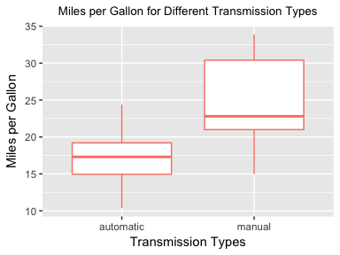
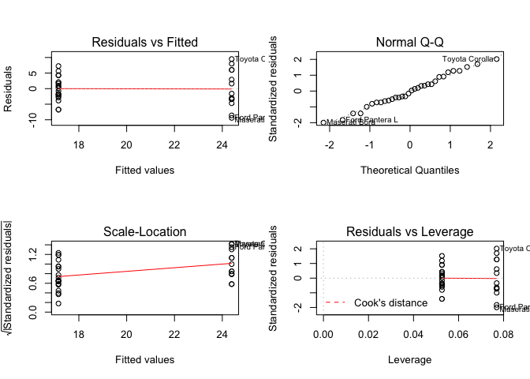
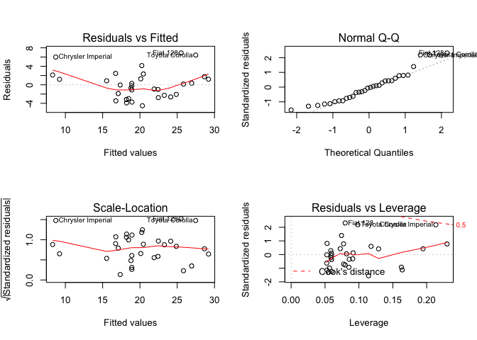

Research Questions
------------------

1.  Is an automatic or manual transmission better for MPG?

2.  Quantify the MPG difference between automatic and manual
    transmissions?

Executive Summary
-----------------

On the surface, manual transmission is better for MPG. The magnitude of
MPG difference is at about 7.25 more MPG in favour of manual
transmission. However, further analyses shows that transmission is a
poor predictor of MPG.

### Analyses

### Load Data

    data(mtcars)

### Hypothesis Tests and Modelling

Plots suggest that manual cars are better for MPG than for automatic
cars. Hence, tests and models will further investigate this hypothesis.

#### T-tests For Miles per Gallon With Different Transmission Types

    with(mtcars, t.test(x = mpg[am == 0], y = mpg[am == 1], alternative = "two.sided"))

    ## 
    ##  Welch Two Sample t-test
    ## 
    ## data:  mpg[am == 0] and mpg[am == 1]
    ## t = -3.7671, df = 18.332, p-value = 0.001374
    ## alternative hypothesis: true difference in means is not equal to 0
    ## 95 percent confidence interval:
    ##  -11.280194  -3.209684
    ## sample estimates:
    ## mean of x mean of y 
    ##  17.14737  24.39231

Null hypothesis of equal means are rejected. Therefore automatic and
manual transmission have difference means in terms of MPG which are
statistically significant at 5%.

------------------------------------------------------------------------

#### Linear Models of Miles per Gallon Against Transmission Types

##### Miles per Gallon ~ Transmission Types

    m1 <- lm(mpg ~ factor(am), data = mtcars)
    summary(m1)

    ## 
    ## Call:
    ## lm(formula = mpg ~ factor(am), data = mtcars)
    ## 
    ## Residuals:
    ##     Min      1Q  Median      3Q     Max 
    ## -9.3923 -3.0923 -0.2974  3.2439  9.5077 
    ## 
    ## Coefficients:
    ##             Estimate Std. Error t value Pr(>|t|)    
    ## (Intercept)   17.147      1.125  15.247 1.13e-15 ***
    ## factor(am)1    7.245      1.764   4.106 0.000285 ***
    ## ---
    ## Signif. codes:  0 '***' 0.001 '**' 0.01 '*' 0.05 '.' 0.1 ' ' 1
    ## 
    ## Residual standard error: 4.902 on 30 degrees of freedom
    ## Multiple R-squared:  0.3598, Adjusted R-squared:  0.3385 
    ## F-statistic: 16.86 on 1 and 30 DF,  p-value: 0.000285

This linear model seems to affirm the result of the t-test. Indeed, this
model predicts 7.25 more MPG for manual cars as compared to automatic
cars.

##### Miles per Gallon ~ Transmission Types + Weight

    c <- with(mtcars, cor(wt, am))
    m2 <- lm(mpg ~ factor(am) + wt, data = mtcars)
    summary(m2)

    ## 
    ## Call:
    ## lm(formula = mpg ~ factor(am) + wt, data = mtcars)
    ## 
    ## Residuals:
    ##     Min      1Q  Median      3Q     Max 
    ## -4.5295 -2.3619 -0.1317  1.4025  6.8782 
    ## 
    ## Coefficients:
    ##             Estimate Std. Error t value Pr(>|t|)    
    ## (Intercept) 37.32155    3.05464  12.218 5.84e-13 ***
    ## factor(am)1 -0.02362    1.54565  -0.015    0.988    
    ## wt          -5.35281    0.78824  -6.791 1.87e-07 ***
    ## ---
    ## Signif. codes:  0 '***' 0.001 '**' 0.01 '*' 0.05 '.' 0.1 ' ' 1
    ## 
    ## Residual standard error: 3.098 on 29 degrees of freedom
    ## Multiple R-squared:  0.7528, Adjusted R-squared:  0.7358 
    ## F-statistic: 44.17 on 2 and 29 DF,  p-value: 1.579e-09

    anova(m1, m2)

    ## Analysis of Variance Table
    ## 
    ## Model 1: mpg ~ factor(am)
    ## Model 2: mpg ~ factor(am) + wt
    ##   Res.Df    RSS Df Sum of Sq      F    Pr(>F)    
    ## 1     30 720.90                                  
    ## 2     29 278.32  1    442.58 46.115 1.867e-07 ***
    ## ---
    ## Signif. codes:  0 '***' 0.001 '**' 0.01 '*' 0.05 '.' 0.1 ' ' 1

Considering the high correlation between weight and tranmission types
(-0.6924953), it is wise to include it in predicting MPG. Curiously, the
effect of transmission types became almost irrelevant in this model.
Given the near zero coefficient, holding weight constant. The higher
adjusted R squared shows that this model is a better fit than the
previous one. Anova tests further affirms this.

Conclusion
----------

It is found that manual transmission is better for MPG, with a magnitude
of 7.25 additional MPG for manual cars. However, by including weight of
cars, it becomes apparent that transmission types are poor predictor of
MPG, as the coefficient is not statistically significant. Caution is
advised in modelling MPG as there are variables which have yet to be
included which might result in biased coefficients.

------------------------------------------------------------------------

Appendices
----------

### Exploratory Plots of Miles per Gallon vs Transmission Types

#### Convert 0/1 in am to Automatic or Manual For Easier Interpretation

    for (i in 1:nrow(mtcars)) {
      if (mtcars$am[i] == 0) {
        mtcars$am1[i] = "automatic"
      } else {
        mtcars$am1[i] = "manual"
      }
    }

#### Boxplot of Miles per Gallon for Different Transmission Types

    require(ggplot2)

    ## Loading required package: ggplot2

    ggplot(data = mtcars, aes(y = mpg, x = factor(am1))) +
      geom_boxplot(col = "salmon") +
      labs(title = "Miles per Gallon for Different Transmission Types", 
           x = "Transmission Types", y = "Miles per Gallon") +
      theme(plot.title = element_text(hjust = 0.5, size = 10))

    diff.m <- median(mtcars$mpg[mtcars$am1 == "manual"]) - 
      median(mtcars$mpg[mtcars$am1 == "automatic"])

Automatic vehicles seem to have lesser MPG than manual cars according to
the boxplot. And the difference in the medians appears to be quite large
as well, around 5.5 MPG.

### Analytic Plots of Linear Models

    par(mfrow = c(2,2))
    plot(m1)

    par(mfrow = c(2,2))
    plot(m2)

Plots of model 1 is shows that residuals are rather evenly distributed
into two groups. Residuals are also quite normal. Model 2 plots shows
however that Chrysler Imperial, Fiat 128 and Toyota Corolla are among
the outliers.
